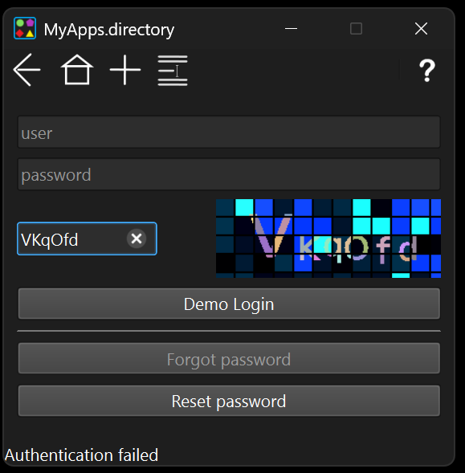
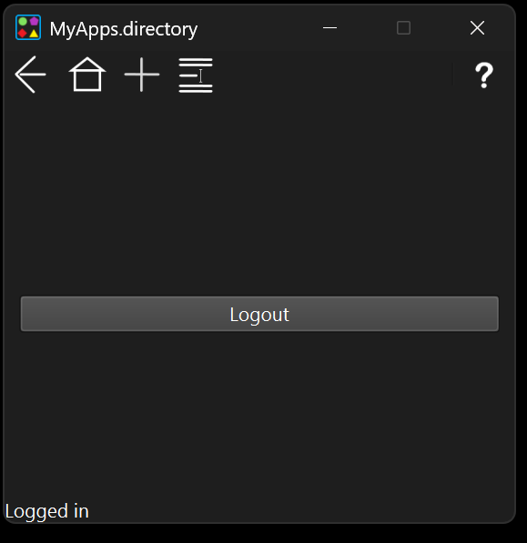
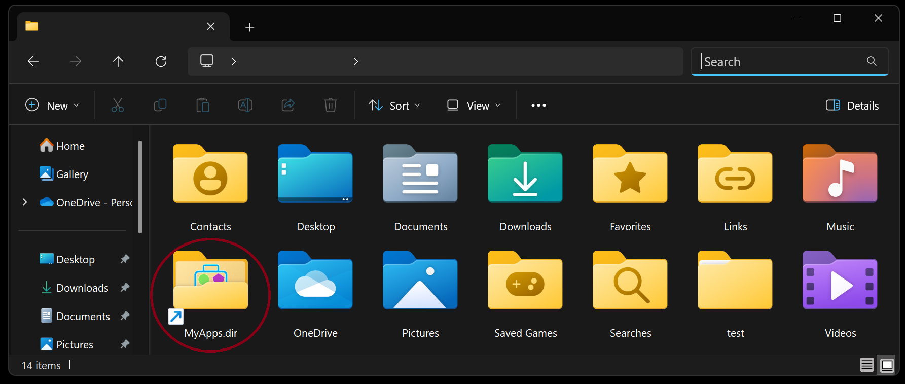
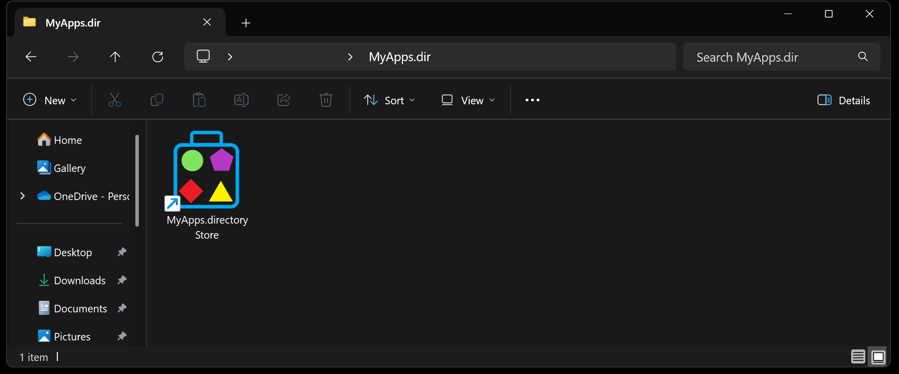
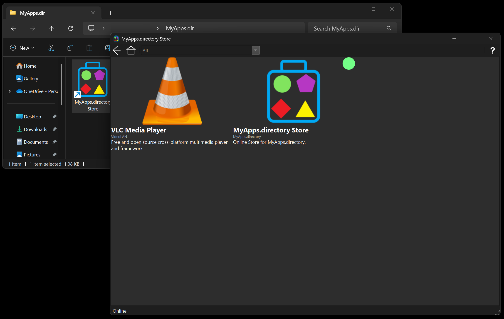
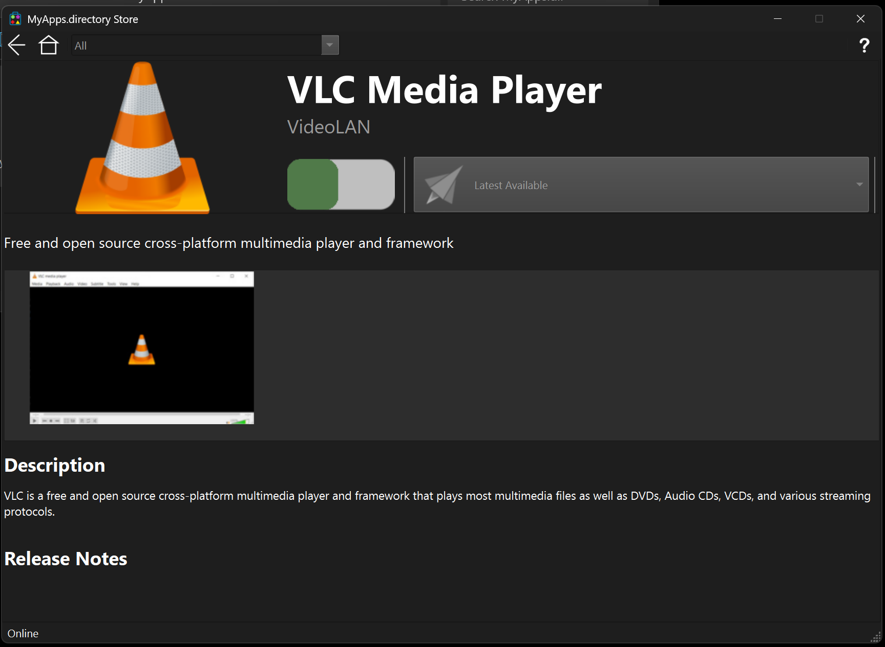
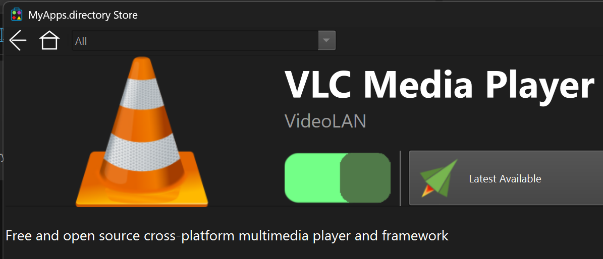
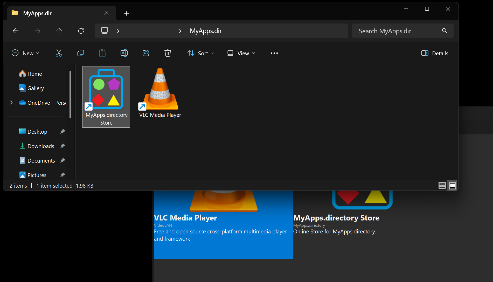
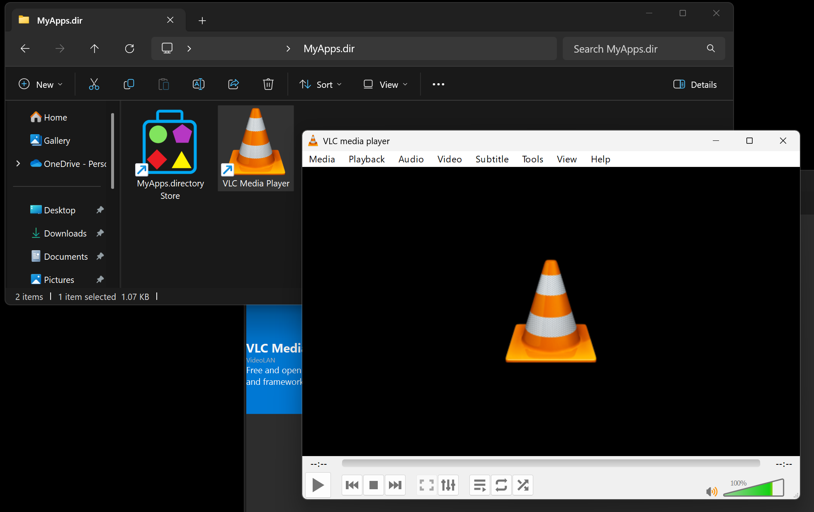
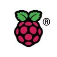

# MyApps.directory Client

The Application Repository Filesystem - Run any available applications from the repository without installing it on the local machine.
For now the MyApps.directory Client is only available for Windows 10/11 x86_64

## Copyright

Copyright &copy; 2020-present Valentin Palade (vipalade @ gmail.com).

All rights reserved.

## License

[GPLv3](LICENSE)

# What to expect

 * __Use the MyApps.Directory Client application at your own risk! Currently it is in early preview stage thus one might experience crashes and different scenarios not running as expected. Please bare with it and if possible, report bugs__.
 * For now, the server side runs on a development cluster of RaspberryPis with no guaranteed outbound bandwidth - expect low download speeds and high latencies.
 * The communication with the server is SSL encrypted.
 * Currently only a limited number of one hour time limited Demo accounts are available.

# Install steps

Download the latest release asset from [GitHub MyApps.Directory-Client releases page](https://github.com/myapps-directory/myapps-client/releases).

The client application depends on [WinFsp](https://winfsp.dev/) to be installed.
If you already have it installed download and install the msi package; otherwise choose the bundle. Follow the steps from either one.


# Configuration
Once successfully installed, the MyApps.Directory Authentication window should appear on screen:



In order to start with a one hour time limited demo account just fill the Captha string and either hit enter or push the "Demo Login" button.
There are only a limited number of available demo account slots. If you receive an authentication error, it can be either that the Captha is wrong or that there are no available slots.

If everythig is ok, you should see:



You can now close the Authentication window, start Windows Explorer (`Win`+ E) and go to home folder - there you should see a new MyApps.dir folder:



Double click the MyApps.dir to open the folder.

So far there is only one application available - __MyApps.Directory Store__. It can be used to enable different other applications from the MyApps.Directory Store:



Launch __MyApps.Directory Store__:



Double click on an application from the Store (e.g. VLC):



To enable the application locally, just click the green button:



Now, move back to the Windows Explorer MyApps.Dir window and wait for a few seconds (sometimes refreshing the content might be required) for the shortcut to the enabled application to appear.



Double click the shortcut to start the application - wait for a few seconds for the application data to be downloaded and for the application to start.



At this point, the MyApps.Directory Client application will only download the strictly necessary files for the application to run and cache them locally so that subsequent runs will start faster.

## Server side

Powered by 

The server side runs on a small development cluster of RaspberryPIs.

## Configure CMake build for Visual Studio

```BASH
 ./configure -b debug -f debug -e ~/work/external_debug_x64/ -g "Visual Studio 16 2019" -P "-DSolidFrame_DIR=~/work/solidframe/build/debug" -P "-DQT5PREFIX_DIR:PATH=/c/data/qt/5.15.0/msvc2019_64/lib/cmake" -P "-DMYAPPS_FRONT_URL:STRING=aws-dev.host" -A x64
 ./configure -b release -f release -e ~/work/external_release_x64/ -g "Visual Studio 16 2019" -P "-DSolidFrame_DIR=~/work/solidframe/build/release" -P "-DQT5PREFIX_DIR:PATH=/c/data/qt/5.15.0/msvc2019_64/lib/cmake" -P "-DMYAPPS_FRONT_URL:STRING=front.myapps.directory:443" -A x64
 ./configure -b debug -f debug_x64 -e ../external_debug_x64/ -g "Visual Studio 17 2022" -P "-DSolidFrame_DIR=~/work/solidframe/build/debug" -P "-DQTPREFIX_DIR:PATH=/c/Qt/6.3.1/msvc2019_64/lib/cmake" -P "-DMYAPPS_FRONT_URL:STRING=front.myapps.directory:443" -A x64
```
